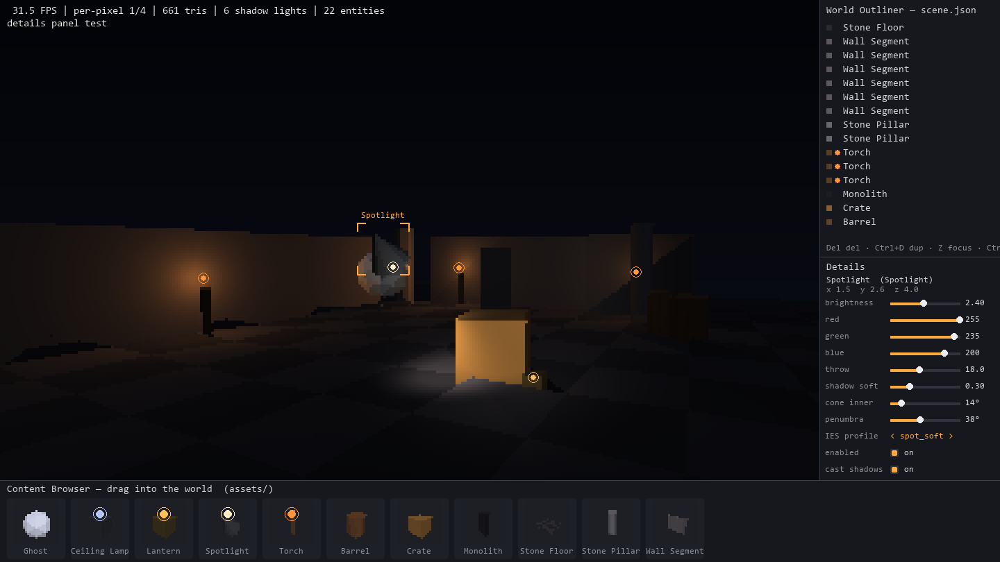
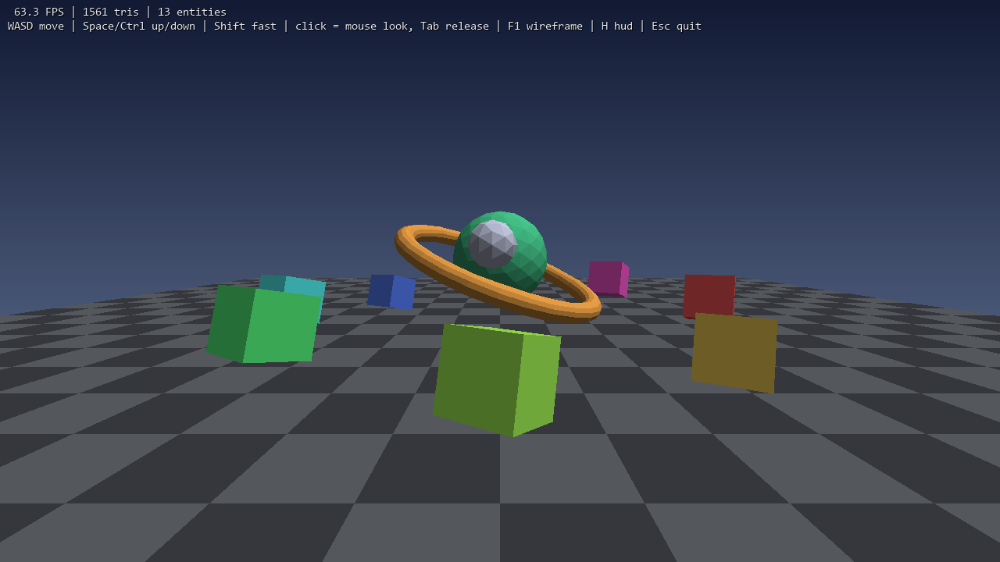

# PyEngine

A compact real-time 3D game engine and world editor written in pure Python,
using **numpy** for the vectorized transform/lighting/ray-tracing pipeline and
**pygame** (SDL) only as a window/rasterization backend. No OpenGL — the 3D
pipeline itself is all Python.

| Editor | Demo |
|---|---|
|  |  |

## Run it

```
py -m pip install pygame numpy
py editor.py     # world editor with the survival-horror starter scene
py demo.py       # bright playground demo
```

### Editor controls

| Input | Action |
|---|---|
| **RMB (hold)** | mouse look + WASD/Space/Ctrl fly, Shift = fast |
| **LMB** | select in viewport/outliner; drag assets from the content browser into the world; drag sliders in the Details panel |
| **Z** | focus camera on selection |
| **Ctrl+D / Del** | duplicate / delete selection |
| **Ctrl+S** | save scene (`scenes/scene.json`) |
| **F** | toggle flashlight |
| **C** | toggle player collision (on by default — walls block you) |
| **F1 / F2** | wireframe / switch per-pixel <-> flat lighting |
| **H / Esc** | HUD / quit |

Select any light (viewport or outliner) and the **Details panel** exposes it:
brightness, RGB color, throw (range), shadow softness, spotlight cone inner
angle and penumbra, IES profile, enabled, and shadow casting. Edits apply
live and persist through Ctrl+S.

The mouse is only captured while a look button is held — release and the
cursor is free (demo uses LMB *or* RMB; the editor reserves LMB for selection).

## Architecture

```
engine/
  math3d.py     Vec3 + 4x4 matrix builders
  mesh.py       Mesh + primitives: cube, box, cylinder, icosphere, torus, checkerboard
  camera.py     perspective camera, world<->screen projection, mouse picking rays
  lighting.py   DirectionalLight, PointLight, SpotLight, Fog
  raytrace.py   ray-traced soft shadows + scene picking (Moller-Trumbore, vectorized)
  scene.py      Scene / Entity / Transform / Behavior (component system)
  behaviors.py  Spin, Bob, Orbit, Flicker, FlyController, FlashlightController
  input.py      per-frame keyboard/mouse state, hold-to-capture mouse
  renderer.py   software renderer: multi-light color accumulation + painter's sort
  core.py       Engine: window, fixed-timestep loop, HUD, overlay hook, benchmarks
  assets.py     self-contained JSON assets + scene save/load
editor.py       world outliner, content browser, drag-drop placement
assets/*.json   the asset library (drag these into the world)
scenes/         saved scenes
demo.py         bright playground demo
```

### Per-pixel deferred lighting

The default shading path lights every pixel individually. Depth-sorted
triangles are filled into a low-resolution *face-ID buffer* (pygame's C
rasterizer), then numpy reconstructs each pixel's world position by
intersecting its camera ray with the face's plane and evaluates every light
per pixel: smooth distance falloff, smooth spotlight cones with adjustable
penumbra, IES angular profiles, per-pixel fog. The frame is upscaled to the
window — the chunky internal resolution (`--pixel-scale`, default 1/4) is
both the performance budget and a deliberate PS1-horror aesthetic. F2 falls
back to classic flat per-face shading.

Lights carry an **IES profile** — an angular intensity curve like real
photometric IES files (`uniform`, `spot_soft`, `downlight`, `batwing`),
sampled against the angle from the light's axis per pixel.

### Collision

The player is a sphere tested against every collidable entity's oriented
bounding box, resolved in the entity's local space so rotated walls work and
the player slides along surfaces instead of sticking. `"collidable": false`
in an asset opts out (the Ghost — you walk right through it).

### Ray-traced soft shadows

Lights are physical spheres (`radius`), not points. For every face a light
reaches, the tracer casts `shadow_samples` rays from the face toward points
distributed across the light's sphere and intersects them against all
shadow-casting geometry (vectorized Moller-Trumbore, rays x triangles in
chunks). The unblocked fraction is the shadow factor — fully blocked faces go
dark, partially blocked faces land in the penumbra, so shadow edges are soft.
Shadow granularity is per *face*; the per-pixel path modulates its smooth
per-pixel light with these per-face factors.

What keeps it real-time:

- **Caching** — factors are cached per (receiver, light) and reused until the
  receiver, the light, or any shadow caster actually moves. A fully static
  scene traces once, then shadows are free; light *flicker* changes intensity,
  not geometry, so it never invalidates the cache.
- **Amortization** — moving lights retrace every `shadow_interval` frames
  (the flashlight uses 2), and receivers that move while everything else is
  static reuse their factors for up to 3 frames.
- **Culling** — only faces a light actually reaches get rays, and only
  occluders within the light's range are tested.

Tuning: fewer `shadow_samples` = faster + harder shadows; `cast_shadows:
false` on a light skips tracing entirely; `casts_shadow: false` on an entity
(the ghost, the floor) removes it from the occluder set — a moving caster
invalidates the whole cache, so keep animated things out of it when you can.

### Self-contained assets

One JSON file per asset in `assets/` — mesh, light, and behaviors together,
so the object works dropped into any scene:

```json
{
  "name": "Torch", "category": "lights",
  "mesh": {"primitive": "cylinder", "radius": 0.1, "height": 1.5, "color": [84, 62, 40]},
  "light": {"type": "point", "color": [255, 150, 60], "intensity": 2.2,
            "range": 12, "radius": 0.3, "shadow_samples": 8, "offset": [0, 0.95, 0]},
  "behaviors": [{"type": "Flicker", "amount": 0.35, "speed": 9}]
}
```

The content browser renders a live 3D thumbnail of each asset at startup.
Drop a new `.json` in `assets/` and restart the editor to see it. Scenes
serialize as asset name + transform per entity, plus the scene's lighting,
fog, and sky — everything you place round-trips through `Ctrl+S`.

### Renderer and loop

Per frame the renderer transforms every mesh to world/camera space in numpy
matmuls, accumulates lighting per face (ambient + directional + every
point/spot light with distance/cone attenuation, colored per channel, times
its ray-traced shadow factor), backface-culls, clips against the near plane,
blends distance fog, depth-sorts all faces from every mesh together (painter's
algorithm), and fills polygons with pygame's C rasterizer. `Engine.run()`
updates behaviors on a fixed 60 Hz timestep, decoupled from render rate.
Known trade-off: painter's sorting is per-face, so interpenetrating geometry
can occasionally sort wrong — the classic software-rendering compromise.

Measured on this machine at 1440x810: the starter horror scene (6
shadow-casting lights, flashlight on) runs ~28-33 FPS with per-pixel
lighting at 1/4 internal resolution, ~38-45 FPS in flat mode; the bright
demo scene ~53 FPS at 1280x720.

## Extending it

- **New asset**: drop a JSON in `assets/` (see above) — it appears in the
  content browser on next launch.
- **New behavior**: subclass `Behavior` in `engine/behaviors.py`, reference it
  by class name from asset JSON.
- **New primitive**: add a `Mesh` factory in `engine/mesh.py` and register it
  in `engine/assets.py`.
- **Load models**: an OBJ loader is ~20 lines — parse `v`/`f` lines into the
  arrays `Mesh` takes, then register a `"model"` factory.
